# Deployment pipeline design

[Pipeline overview and draft status](README.md) · [Repository home](../../README.md)

```mermaid
flowchart LR
  PR[Human or AI pull request] --> CI[Unprivileged validation]
  CI --> REVIEW[Required independent review]
  REVIEW --> BUILD[Build once / sign / provenance]
  BUILD --> DEV[Development]
  DEV --> TEST[Test]
  TEST --> STAGE[Isolated staging]
  STAGE --> GATE[Protected production gate]
  GATE --> CANDIDATE[Production candidate slot]
  CANDIDATE --> CHECK[Warmup / smoke / dependency checks]
  CHECK --> SWITCH[Swap or progressive traffic]
  SWITCH --> SLO[Observe SLO and business metrics]
  SLO -->|Healthy| DONE[Complete and retain prior artifact]
  SLO -->|Regression| BACK[Stop rollout / restore prior version]
```

## Validation and security

1. PR runs formatting, lint, unit/contract tests, secret scan, SAST, dependency/license
   checks, IaC scanning and policy tests. Untrusted PR code never receives deployment
   credentials, private-network runner access, or secret-bearing execution contexts.
2. Trusted infrastructure planning runs with a separate narrowly scoped identity.
   Review resource changes, replacements/deletions, IAM, exposure, and cost delta.
   Treat Terraform config, external providers and data sources as executable code.
3. Build once on trusted CI, generate an SBOM, scan the package/image, sign artifact
   and provenance. Pin external workflow actions to reviewed immutable commit IDs.
4. Promote identical package checksums or image digests; keep configuration and
   secrets separate per environment. Verify signatures before deployment.
5. Dev: smoke tests. Test: integration, contracts, negative authorization tests.
   Staging: DAST, representative load, rollback/restore rehearsal and migration tests.
6. Production gate validates artifact, target, IaC plan, risk tier, change ticket and
   approver. Approval does not carry over if artifact, plan or target changes.

## Identity and state

- OIDC federation constrained to repository, protected environment and approved workflow.
- Separate identities for CI planning, IaC provisioning and application deployment,
  with separate production and nonproduction scopes.
- Private ephemeral runners access app/SCM private endpoints and restricted Terraform backend.
- Concurrency lock per service/environment. Store plans securely with short retention;
  plans and state can contain sensitive values.
- Apply the approved saved plan. If state changes, the plan expires, or the target
  materially drifts, re-plan, re-check and obtain the appropriate approval.
- Changes to federation, pipeline protections, policy exemptions and RBAC go through
  a separate platform/security workflow; application automation cannot grant itself access.

## Deployment and rollback

- A production candidate slot is inside the production boundary. It is separate from
  the isolated staging environment. Configure its identity, DNS, private endpoint,
  environment-specific settings and dependencies explicitly; do not assume swaps move them.
- Warm candidate instances and test from an authorized private runner. Gate the switch
  on readiness and synthetic transactions. Application-specific canary routing requires
  suitable ingress configuration and session/state handling.
- During an agreed observation window compare error rate, p95 latency, saturation,
  business success rate and release-specific SLO burn against a baseline. Thresholds
  depend on traffic and SLO; do not copy arbitrary universal thresholds.
- On regression stop promotion and shift traffic back/swap back or redeploy the retained
  signed artifact. Verify recovery; notify the on-call and link incident to deployment.
- Database migrations use expand/contract with backward-compatible schemas. A code swap
  does not undo data changes. Delay destructive migrations until the rollback window closes;
  use forward repair or approved point-in-time restore when necessary, with explicit RPO impact.
- Infrastructure rollback is a reviewed remediation plan, not blindly applying an old
  configuration or restoring a state file. Protect stateful resources and test recovery.

Routine deterministic releases may auto-promote under a pre-approved release policy.
Destructive changes, privileged access changes, and AI-proposed production operations
require explicit human review; an AI agent cannot approve its own change.
